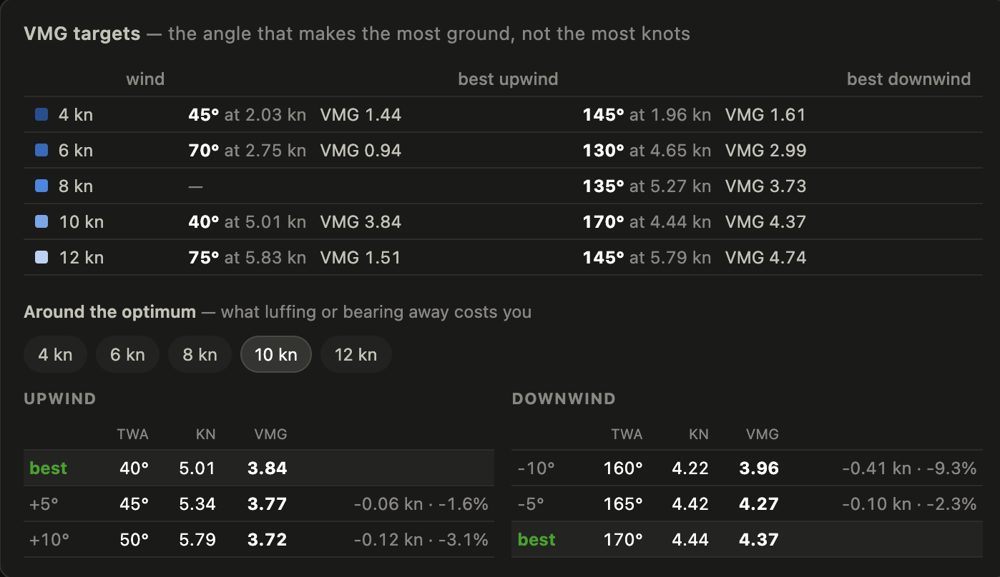

# signalk-autopolar

Learns your boat's polar on its own, by watching the way she is actually
sailed. The more miles you put in, the better it gets — and you never have to
sail a single test run.
Built-in web app: live recording state, polar diagram, VMG analysis, SOG against STW and
true against apparent wind, scatter of the underlying measurements, outlier
editing, speed-sensor diagnostic, and `.pol` / CSV export.


---

## Why this one

Existing polar recorders take too much on trust. Four decisions set this one
apart.

### 1. A point is kept only on one single regime — which is not the same as a constant one

A sailing boat never holds a course, a speed and a wind steady for 60 s: the
sea rolls her, gusts fire her up, the pilot hunts. Demanding steadiness would
collect nothing at all, or collect only in flat calm — precisely where a polar
learns nothing.

So what invalidates a point is not that the numbers *move*, it is that they
*go away*. The gate separates the two:

- **drift** — the mean of the last third of the window minus the mean of the
  first third. If the point of sail, the wind strength or the boat speed has
  drifted, the end of the window no longer describes the same boat as the
  start: rejected.
- **spread** — the swing around that mean. Tolerated generously (±22° of
  apparent wind angle, ±4 kn of wind, ±1.25 kn of boat speed by default), and
  it is exactly what gets averaged. The ceilings are guard rails only: past
  them nothing is being measured any more (masthead unit flogging in a rail-to-
  rail roll, a run of surfs).

**The window slides, it is not flushed.** One second out of bounds does not
cost you the previous 59: as soon as it drops off the far end, the window
becomes valid again on its own. Only a manoeuvre justifies throwing the lot
away — a tack does not "leave" the window, it cuts it into two different
regimes.

Every point carries a **confidence score** (`quality`, 0 to 1) saying how calm
the window was relative to the tolerated ceilings, so you can keep only the
best measurements later without collecting again.

And the gate always says **why** it refuses, live in the web app, with drift
and spread shown side by side.

### 2. The raw data is kept

Everything seen under sail is written second by second to `samples.jsonl`,
*before* the gate. If the thresholds turn out to be wrong for the day's sea
state, you replay the file ("Replay the raw log") instead of sailing the
passage again. About 15 MB per 30 h.

### 3. Nothing is frozen at collection time

Every point carries SOG *and* STW, true *and* apparent wind. The four polars
(SOG|STW × true|apparent) are four readings of the same measurements,
recomputed on demand — as are the choice of statistic, the bin widths, and the
tack and sail-plan filters.

### 4. It tells you whether to believe your speed sensor

See below — this is what decides which of the SOG and STW curves is the
trustworthy one, and most recorders never ask the question.

## Never under engine, never at anchor

A polar describes what the sails do. One hour of motoring folded into it lifts
every number and there is no way to tell afterwards which points were honest.
So the rule is deliberately blunt: **no evidence that the engine is off, no
collection.** The plugin would rather record nothing than record something
wrong.

### What counts as evidence

Two standard SignalK paths, either of which is enough:

| path | what it is |
|---|---|
| `propulsion.<engine>.state` | `started` / `stopped` |
| `propulsion.<engine>.revolutions` | any non-zero value means the engine is turning |

**`state` is preferred**, for a simple reason: it answers the question
directly and cannot be ambiguous. `revolutions` is only ever read as a
yes/no — anything other than zero means the engine is running — so it makes
no difference what unit the gateway sends it in or how it is scaled. When both
paths are present and they disagree, the plugin assumes the engine is
*running*. Losing one point costs one point; letting a motoring point into the
polar costs the polar.

If you have several engines, any one of them running is enough to stop
collection.

### Do I need the autostate plugin? No.

`signalk-autostate` is a fine plugin, but it will not solve this problem,
because **it reads the same two paths** — `propulsion.*.state` and
`propulsion.*.revolutions`. On a boat with no engine data it does not deduce
anything: it answers with the fixed value you set in its own configuration,
`default_propulsion`, which ships as `sailing`. Installing it on an engineless
data setup would therefore declare "sailing" all day, motoring included, and
quietly poison your polar. That is worse than collecting nothing.

Where it does help is as a **safety net for boats that already have engine
data**. If your engine feed dies mid-passage — a bridge that drops, a NMEA
device that stops talking — autostate keeps reporting the last state it knew.
Die under sail and it stays on `sailing`, so the passage is not lost; die under
engine and it stays on `motoring`, so nothing is collected. It errs on the safe
side in both directions. This plugin uses that as a last resort only, and only
if it has seen real engine data at least once during the session — otherwise
"sailing" would mean "no idea". Points collected that way are tagged
`engineSource: "autostate"` and stay filterable afterwards.

### My boat has no engine data at all

Then by default nothing is collected, and the web app says `engine state
unknown` rather than pretend. That is the honest outcome — but it is fixable,
usually cheaply. **You do not need a tachometer, only a signal that says
*running*.** An oil-pressure switch, the alternator's D+ terminal or the
ignition line, wired to any input that can publish
`propulsion.<engine>.state`, is enough. That one boolean unlocks everything,
permanently.

Until then, you can say it yourself: the web app offers a **"I am sailing"
declaration**, good for 90 minutes and renewable. It is the only place where
the plugin takes a human's word for it, so it is bounded in two ways. The
declaration expires on its own — forgetting to renew it costs you a few points,
and there is no way to forget to switch it off and quietly feed an hour of
motoring into your polar. And every point recorded that way is tagged
`engineSource: "declared"`, stays filterable, and is **left out of any polar
you share**: nobody else can check a declaration.

### At anchor and alongside

`navigation.state` set to `anchored` or `moored` also blocks collection — but
only if boat speed agrees. That state is often minutes behind reality, and a
boat clearly making way is not moored whatever the flag says.

### One setting to know about: slow engine data

Wind and boat speed arrive several times a second off the NMEA 2000 bus. Engine
data often does not: bridged over MQTT from a Cerbo GX, for instance, it lands
**once a minute**. Judged by the same freshness rule as the rest, the engine
would read "unknown" 54 seconds out of every 60 and nothing would ever be
collected. Hence a separate `engineStaleMs`, 180 seconds by default. If your
engine feed is slow, that is the first setting to look at.

## Is your speed sensor telling the truth?

Speed through the water and speed over ground almost never agree. The gap has
two very different causes, they call for opposite responses, and they decide
which of the two polars is worth exporting.

**Current.** The gap is the set you are carrying. Nothing is wrong with the
sensor, and **STW is the axis to trust**: it describes the boat moving through
the water her sails are actually working in. SOG, carrying the set with it, is
not a property of the boat at all.

**A sensor error.** The paddlewheel reads high or low. The gap then lies along
the hull's fore-and-aft axis and grows with boat speed. Here **SOG is the axis
to trust** — provided there is not much current.


### What actually separates them

The textbook answer is that current is fixed in the earth frame while a sensor
error is fixed in the boat frame. That is true instant by instant, and it is
the basis of the first test the plugin runs — but on its own it is not enough,
and it is worth being honest about why:

- **Current is not one vector for a whole passage.** It turns with the tide, it
  accelerates round headlands and through narrows and estuaries, and it changes
  with the hour of the day. Fifteen hours of sailing may have carried three
  different sets. The direction test needs a stretch over which the current can
  reasonably be treated as steady, and legs on genuinely different headings.
- **Leeway also lies in the boat frame.** The water track is drawn along the
  heading, but the boat crabs a few degrees to leeward. On a passage sailed
  mostly on one tack that consistent sideways offset can look like a fixed
  boat-frame vector and flatter the "sensor" verdict. It is athwartships rather
  than fore-and-aft, which is why the test measures concentration rather than a
  bearing — but it is a reason not to lean on this test alone.
- **A compass error** rotates the water track, and with it the implied current,
  without changing its length at all.

So the plugin runs a second test that ignores direction entirely:

> **Does the gap grow with boat speed?** A current sets you by roughly the same
> number of knots whether you are making three or nine. A scale error in the
> sensor offsets you *in proportion* to your speed. Both models are fitted to
> your own points and compared, and the better fit wins.

This one still works on a single tack, which is often all a passage gives you.
When the two tests agree the verdict is solid. When they disagree, or when
neither has enough variety to speak, the plugin says so instead of picking one.

### The test you can run yourself, and it beats both

**A sensor error is permanent. Current is not.** Sail the same water on the
opposite tide and a current reverses; a paddlewheel that reads 10 % high reads
10 % high on every passage, in every sea, for ever. That is the real proof, and
no single outing can provide it.

Which is why every point is kept. Collect over several passages, in different
places and at different states of the tide, and look at whether the discrepancy
keeps the same shape. If it does, it is the sensor. If it comes and goes with
the water you were in, it was the water — and your sensor was fine all along.

### The correction table

Permanent does not mean constant. On the boat this plugin was written for, the
error runs from about 2 % at 2.5 kn to 14 % at 10 kn. A single calibration
figure would be wrong nearly everywhere, which is exactly why speed sensors
such as the Airmar DST810 offer a multi-point calibration table rather than one
number.

When the verdict points at the sensor you get:

- a **CSV correction table** from 1 to 10 kn — indicated speed, measured real
  speed, factor and error — in the shape the DST810's advanced speed
  calibration table expects. Speed bands you have never sailed are left blank
  rather than invented;
- a fourth boat-speed reading in the diagram, **STW corrected**, so you can
  check that the corrected curve falls on the SOG curve.

Two honest caveats before you type anything into an instrument. The table is
only as good as the assumption that nothing else moved the water while you
collected it, so it deserves several passages behind it. And the DST810's
advanced table has a heel axis as well as a speed axis: this export fills the
speed axis only. Points do carry heel, but splitting them by heel as well
would leave too few measurements in each cell to be worth trusting.

Nothing here ever rewrites a measurement. The corrected polar is one more
reading of the same raw data, alongside the other three.

## True wind

Read from `environment.wind.angleTrueWater` / `speedTrue` when the server
publishes them (`signalk-derived-data` does): source priorities and leeway are
already resolved there, and two diverging truths help nobody. Only otherwise
is it recomputed from apparent wind and boat speed. The web app says which
source is in use.

The **AWS/AWA** polar is a direct anemometer measurement — it depends on
neither speed-sensor nor compass calibration. The **TWS/TWA** polar is a
computation: if STW or the compass are out, it is wrong *consistently*.
Comparing the two in the web app is a calibration diagnostic as much as a
performance reading.

## Smoothing

On a single passage a cell often holds only two or three measurements: the
curve comes out saw-toothed and a raw `.pol` would give erratic routing. The
smoothing (on by default, switchable) is a moving average over neighbouring
cells weighted by their sample count — a well-filled cell pulls its neighbours,
not the other way round. Nothing is invented: an empty cell stays empty, a
hand-overridden cell is left alone, and the measured value stays readable in
the tooltip ("measured …") and in the JSON export.

The curve is also **cut wherever there is a real hole**. Bridging one missing
5° cell is fair interpolation; drawing a straight line across 60° of nothing is
an invention that reads like a measurement. The gaps you see are the angles
still left to sail.

## Statistic per cell

- **mean** (default) — what the boat does on average in those conditions;
- **median** — immune to a single wild measurement;
- **p90** / **max** — what the boat *can* do, closer to the classical idea of
  a polar (a performance envelope, not an average). Keep it for well-filled
  cells: over three measurements, the max is just the most flattering noise.

## VMG targets, and what leaving them costs

Best VMG is the angle that makes the most ground towards (or away from) the
wind, not the most knots. Knowing that angle is not enough, though: what you
actually steer is the shape of the curve around it. If luffing 10° costs 1 % of
VMG you will happily do it to take a gust or spare the crew; if it costs 8 %
you hold the angle. The two cases look alike on a polar diagram, so the plugin
tabulates the neighbouring angles either side of the optimum (±5° and ±10° by
default) with the VMG loss in knots and in percent.



## Where you are right now

The rest of the app looks backwards: what the boat has already done. This part
looks at now — and it is the only part you steer by, so it fits on one line.

Switch **Where I am now** on (it is on by default) and the diagram gets a
marker at your current angle and speed, with the last few minutes trailing
behind it: a sailing boat is never *on* a point, it swings around one, and
seeing the cloud stops you steering to an oscillation. A dashed marker sits on
the curve at the same angle, and the line between the two is the whole point —
short is good, long is a question worth asking.

Underneath, in words:

```
NOW  7.31 kn SOG  at 116° TWA · starboard  in 16.0 kn TWS   96% of the mean polar · −0.30 kn
Polar here: 7.61 kn — from 14 kn (n=6) + 16 kn (n=18) · VMG 3.26 downwind
```

Three things are deliberate here.

**The reference is the curve you are looking at.** Same speed (SOG / STW / STW
corrected), same wind, same statistic. Comparing a SOG measurement against an
STW curve would be wrong by around 10 % on a boat whose sensor over-reads, and
nothing on screen would say so.

**It is interpolated between measured wind bands, never extrapolated past
them.** Half a knot of wind should not move the target half a knot. But where
you have never sailed, it says **new ground** instead of stretching a
neighbouring cell across the gap — and that is the useful answer: it tells you
where the polar still has a hole.

**There is no red.** The reference is a mean, so being under it happens half
the time by definition; that is an average, not a fault. The percentage always
says which statistic it is comparing against — switch **Value** to `p90` if you
want to measure yourself against your better runs instead.

The VMG target for the wind band is added when, and only when, you are within
30° of it. On a reach you are not trying to go upwind or downwind, you are
trying to get somewhere: showing "3 knots of VMG lost" against a dead-downwind
optimum would be noise on a course you are holding on purpose.

## Is it worth changing sail?

The sail-plan filter can already draw one curve per configuration, but in
navigation that answers the wrong question. You do not want to know what the
polar looks like under one reef — you want to know what the *other* sail plans
did **here**, in this wind, at this angle, and whether the difference is worth
the manoeuvre.

So the card under the VMG targets groups the measurements in the neighbourhood
of where you are right now by sail plan, and shows the gap in knots against
what is rigged. The window is adjustable (±10° / ±20° / ±30° of angle, ±1 /
±2 / ±4 knots of wind): tighten it when you have plenty of data, widen it when
the table is thin.

It is an observation, not an experiment, and the table is built to say so:

- **Every row carries its evidence** — how many measurements, the wind it
  actually saw, the mean angle it actually sailed, and when it was last sailed.
  A row measured in 17 knots does not compare with one measured in 14, and you
  can see that without leaving the table.
- **Anything under three measurements sits below a line**, unranked. A single
  point can be the fastest row in the table without proving anything, and a
  short ranking looks confident precisely because it is short.
- **Speed only.** Whether one reef is worth taking for the comfort of the crew,
  the state of the sea or the night ahead is a sailor's call, not a number's.

Nothing is controlled here: those sail plans were not sailed at the same
moment, nor in the same sea, and nobody can replay the day with the other sail
up. The plugin gives you the measurements and their circumstances; the
judgement stays yours.

## Web app

`http://<server>:3000/@captnoliv/signalk-autopolar/` — SignalK mounts `public/`
under the package name; `/plugins/signalk-autopolar/` is reserved for plugin
metadata and serves only the API (`/api/...`).

- **Live state** — recording or not, and exactly why; progress of the current
  window; every input with its freshness and age.
- **Sail plan** — a manual selector attached to the recorded points. Main:
  full, 1 / 2 / 3 reefs. Headsail (one at a time): genoa or jib, each
  full / 1 reef / 2 reefs / furled, or gennaker — the reef selector disappears
  for the gennaker, which does not reef. Optional. Changing it flushes the
  current window, which described a different boat.
- **Sail-plan filter** — built from the combinations you have *actually*
  sailed, with their point counts. This is what makes the tagging worth doing:
  "full main + genoa" against "one reef + genoa" at the same wind and angle is
  a directly readable answer.
- **Diagram** — up to 5 wind speeds at once (beyond that neighbouring curves
  stop being distinguishable; the table takes over), tacks merged or split
  (port/starboard asymmetry shows up immediately), a second polar overlaid for
  comparison, raw scatter underneath.
- **Inspect** — click a cell: the scatter of the measurements behind it, each
  timestamped with its sail plan, exclusion by checkbox, or a hand-set value.
  Edits live in `overrides.json`, separate from the measurements: no correction
  ever destroys data.
- **Where I am now** — your position on the polar, live, with the gap to the
  curve at that angle (see above). Switch it off when you are analysing at
  anchor, where "now" means nothing.
- **Worth changing sail?** — what the other sail plans did in this wind at this
  angle, with the evidence behind each row (see above).
- **Export** — `.pol` (qtVlm, OpenCPN, Expedition), CSV with the sample count
  per cell, full JSON backup, and the raw `.jsonl`.

## Fixing the sail plan after the fact

You reef when the boat needs reefing, not when it suits an app. By the time you
remember the selector, an hour of points has already gone in under the wrong
label — and often you never remember at all. So the sail plan can be set on a
whole stretch of time, after the event, in two ways:

- **You remember roughly when.** Type the two times, pick the sail plan, apply.
  Nothing beats that when you know it.
- **You have no idea.** The plugin suggests boundaries. A sail change leaves a
  measurable trace: at the same wind and angle, the boat no longer goes at the
  same speed or sits at the same heel. It looks for *steps* in the gap between
  measured speed and what the polar predicts for those conditions — going
  through the residual, not raw speed, is what stops "we reefed" being confused
  with "the wind dropped". Long gaps in the record are flagged too: you rarely
  sail 45 minutes without a single point by accident.


Three limits, worth stating rather than discovering:

- it tells you **when** something changed, never **what**. Reef or furled
  genoa is your call;
- a change that did not affect performance is invisible by construction;
- a change at the same moment as a wind shift is confused with it. Hence the
  score on each suggestion, and the sensitivity control — the suggestions are
  candidates to review, never a verdict.

On a 15-hour passage with four known sail changes, the balanced setting found
three of them and offered two false candidates. That is the right order of
magnitude to expect: you glance at five timestamps instead of scrubbing 500
points. It also tends to be *earlier* than the label you set by hand, because
you label once things have settled and it sees the change itself.

Corrections live in `overrides.json`, beside the measurements and never inside
them. Replaying the raw log keeps them — which would not be true if the points
themselves had been rewritten, since a replay rebuilds them from the raw log
where the original label is stored.

## Sea state

Sea state moves a polar as much as a reef does — a boat loses the best part of
a knot in a short chop — but nobody types it in from a cockpit at three in the
morning. So it is **measured, not entered**: the peak-to-peak pitch over the
window, which is exactly what a wave does to a hull. It is stored raw on every
point, and turned into a word (calm / moderate / rough) only for display, with
configurable thresholds — the measurement never depends on today's opinion of
where "moderate" starts.

Two caveats. Pitch also depends on point of sail, so the index compares best
within a similar angle range. And routing software will not use it: the `.pol`
format has no sea-state dimension at all, and most routers apply a generic wave
penalty rather than your boat's. Which is precisely why it is worth recording —
so you can tell a flat-water polar from a rough-water one yourself, instead of
averaging them together without knowing.

## Is the polar any good yet?

A point count answers nothing on its own: 500 points all taken on the same
reach in the same breeze do not make a polar. The header therefore reports what
actually makes it usable — cells resting on three or more measurements, how
many wind bands you have covered, the span of angles, the median confidence of
the windows — and, when it falls short, *what is missing* rather than just a
grade.

## Sharing your polar

This plugin is free and stays free. In exchange, the polar it learns from your
boat goes back into a shared pool.

Most production designs have no honest measured polar anywhere. What circulates
is the builder's brochure figure, produced by a velocity prediction program on
a clean hull with a new sail wardrobe and no crew luggage — and every owner
quietly discovers it is optimistic. A polar measured over real passages, with
real sails and a real waterline, is worth more; the only way to get one per
design is for owners to pool them.

**It happens on its own.** Every 500 new points the plugin posts the current
polar to the collector, and each send replaces the previous one for your boat —
so the pool holds your best version, not your first one. Nothing to click,
nothing to remember. Nothing goes out on a clock either: no new points, no
send. Offshore, a failed send is not lost — it is retried on its own once the
link comes back.

Two things make it easy to say yes to:

- **Nothing collected here contains a position.** Not one latitude, not one
  longitude — check `runs.jsonl` yourself. A shared polar says what your boat
  does at a given wind and angle, and nothing whatsoever about where you have
  been or when you were there. There is no track, and no raw log leaves the
  boat.
- **The name is free text.** Your boat's name if you like, a pseudonym if you
  would rather stay anonymous. Nothing verifies it. What matters for the corpus
  is the *model*, as precisely as you can give it: "Beneteau Oceanis 48" is
  useful, "sloop" is not — add the year or the rig variant if the design changed
  during its production run.

The model and the name are asked once, in the plugin configuration, and
**nothing is collected until they are filled in** — a polar nobody can attach to
a design helps nobody, including you. Sharing itself is on by default and can
be switched off in the same place; the plugin then works exactly as before, and
only the pool stops growing.

What is sent is fixed — speed over ground, true wind, median per cell — so that
polars from different boats can be compared, and your display settings never
change it. Points recorded on a "sailing" declaration are left out: nobody else
can check a declaration. The web app shows the whole payload at any time
(**See exactly what is sent**), which is the point: a contribution you cannot
read is one you end up switching off.

## Idle alert (ntfy)

The real risk with this plugin is not that it crashes — it is that it runs
quietly refusing everything, and you find out 30 h later on the dock. A
threshold too tight for the day's sea state shows up in no other way.

After `idleAlertMin` minutes **actually spent sailing** without a single point
being kept (20 min by default), a notification goes out over ntfy with the
dominant rejection reasons — usually enough to know which threshold to relax.
The counter follows sailing time, not wall-clock time: a night at anchor
triggers nothing.

A failed send — no Internet offshore, satellite link down — is queued and
retried until delivered, never silently dropped. The queue is flushed on every
tick, independently of what the gate decides about the current sailing, so it
still drains once you are back at anchor and the network returns. Recovery is
only announced if an alert had genuinely gone out.

Set `ntfyUrl` (topic included) and, if your server needs one, `ntfyToken` in
the plugin configuration. Leave `ntfyUrl` empty to disable the whole thing.

## Data files

In the plugin data directory (`~/.signalk/plugin-config-data/signalk-autopolar/`):

| file | contents |
|---|---|
| `samples.jsonl` | all raw data under sail, 1 line/s, before the gate |
| `runs.jsonl` | the accepted points (one condensed stable window each) |
| `overrides.json` | hand-made exclusions and overridden values |
| `sail.json` | the current sail plan |
| `declare.json` | the running "I am sailing" declaration, if any |
| `share.json` | what has already been sent to the pool, and when |

All plain text, inspectable and repairable by hand from a cockpit with no
network. A line truncated by a power cut is skipped and the rest of the history
stays usable.

## Settings

Everything lives in the plugin configuration, laid out in three tiers. **Data
sources**, at the top, lists the SignalK path read for each of SOG, STW,
apparent/true wind, heading, rate of turn, navigation state and attitude — the
defaults match a standard installation, so only touch this if your boat
publishes one of them somewhere else (a derived-data plugin under a different
key, a wind instrument with apparent wind only, and so on). The middle of the
page is the settings worth knowing about day to day: engine detection, ntfy,
sharing. **Advanced settings** and **Wind speed columns of the polar**, at the
bottom, hold the admission-filter thresholds and the polar grid — tuned
already, and grouped out of the way on purpose. The stability thresholds in
there are the ones worth understanding if you do go in: on autopilot, 10-15°
of heading variation; hand steering in a swell, more like 20-25°. When in
doubt, collect wide and **replay the raw log** afterwards with tighter
thresholds — the operation is reversible as many times as you like.

`publishPerformance` is left off until the polar has proved itself, and should
stay off if another polar plugin is installed: they would all write to the same
`performance.*` paths.

`supportPrompt` controls the one banner described in [Supporting the
plugin](#supporting-the-plugin). Off means it never appears.

## Tests

```bash
npm test
```

`geom` (circular statistics, true wind), `gate` (the admission filter, case by
case), `polar` (binning, statistics, smoothing, exclusions, VMG neighbourhood,
sail filter, exports), `now` (the live reading interpolates between measured
wind bands, refuses to extrapolate past them, and the sail comparison groups
only the neighbourhood — ignoring the sail filter, which would empty the very
question it answers), `speedo` (synthetic worlds where the answer is known:
pure sensor error, pure current, single tack, and the check that correcting a
lying sensor's STW recovers SOG), `sailchange` (a known step is found where it
happened, noise alone triggers nothing, and a retro-fitted sail plan moves the
right points), `notify` (the alert fires once, recovery is announced once, and
a queued alert still gets out at anchor), `share` (nothing leaves the boat
without consent and a boat identity, one send per threshold, and a failed send
is retried rather than lost) and `smoke` —
which runs the whole plugin against a fake SignalK server over a simulated
passage: starboard beat, tack, port beat, then a leg under engine. It checks
that points come out of the steady legs, that none comes out of the tack or the
engine leg, and that replaying the raw log gives the same result back.

Preview the web app with no boat and no server:

```bash
node test/preview.js   # http://localhost:8099/plugins/signalk-autopolar/
```

## Install

From the SignalK app store, or:

```bash
cd ~/.signalk
npm install @captnoliv/signalk-autopolar
sudo systemctl restart signalk
```

No dependencies: nothing to install on board, so no data used offshore.

Then open the plugin configuration and fill in the **boat model** and the
**name to publish under**. The plugin waits for them before collecting
anything — see [Sharing your polar](#sharing-your-polar).

## Supporting the plugin

It is free, MIT, with no account, no telemetry and no nag screen on startup.
What it does cost is a domain, a server for the shared pool and the time that
goes into it. So the web app asks, once:

- **when** the polar it built for you has actually become usable — 15 cells
  standing on three measurements or more, not a number of days or a number of
  app launches. A request that follows a result is not the same request;
- **at most twice** in the life of the installation. Only *don't ask again*
  closes the door for good: tapping the star or the coffee proves nothing —
  the tab may well have been shut straight away — and treating it as final
  would punish the one gesture the banner was hoping for. Those two count as
  *later*;
- **later means later**: it comes back once 90 days have passed *or* the polar
  has gained another 15 solid cells, whichever happens first. There is nothing
  to gain by staying quiet in front of someone who has something new to see;
  the two-appearance cap is what keeps that from turning chatty;
- **never offline**, because a Ko-fi link tapped fifty miles out opens a dead
  tab and burns the one chance for nothing;
- **as a banner, never a modal**. This screen gets read at night under way; no
  amount of gratitude justifies covering the polar.

The state lives on the server, in `support.json`, not in the browser: the web
app gets opened from the phone, the tablet and the laptop, and browser storage
would ask three times. One boat, one request.

Set `supportPrompt` to false in the plugin configuration and the banner never
appears at all. The two link bars — one under the title, one at the foot of
the page — stay put: they are permanent, tied to no milestone, and interrupt
nobody.

★ [Star the repository](https://github.com/CaptnOliv/signalk-autopolar) ·
☕ [Buy me a coffee](https://ko-fi.com/captnoliv)

## Licence

MIT. Sharing is the deal, not a legal condition: no licence can compel you to
send data, and one that pretended to would just be ignored. The plugin asks
once, defaults to yes, and makes it effortless — that is the whole enforcement
mechanism.
