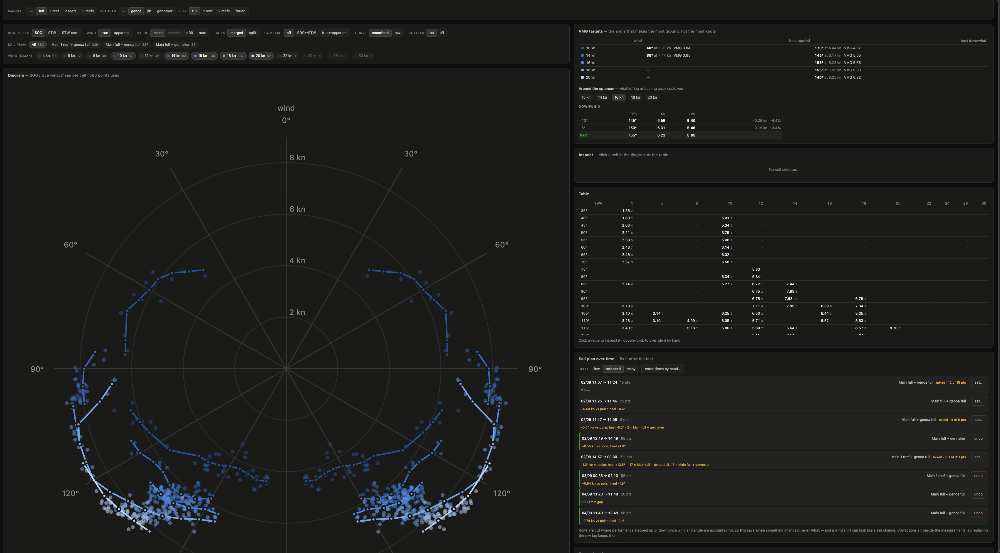
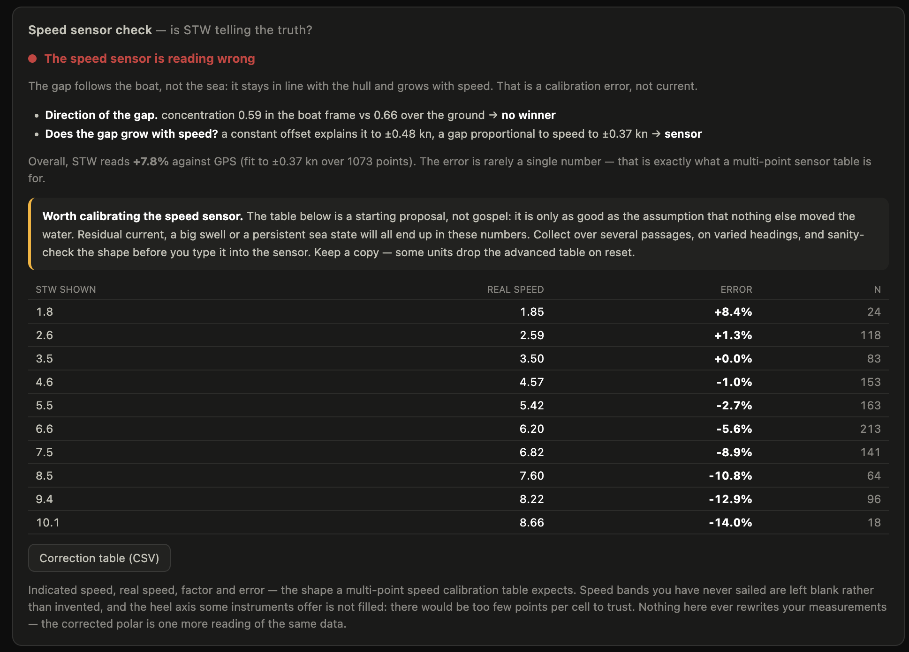
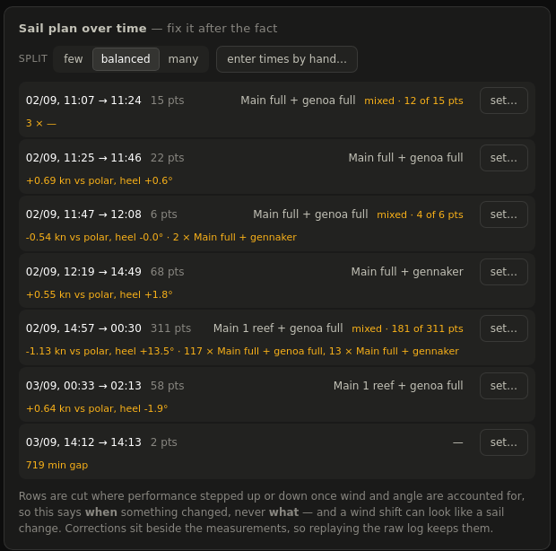

# signalk-autopolar

Learns your boat's polar on its own, by watching the way she is actually
sailed. The more miles you put in, the better it gets — and you never have to
sail a single test run.
Built-in web app: live recording state, polar diagram, VMG analysis, SOG against STW and
true against apparent wind, scatter of the underlying measurements, outlier
editing, speed-sensor diagnostic, and `.pol` / CSV export.



---

## Why this one

Existing polar recorders take too much on trust. Four decisions set this one
apart.

### 1. A point is kept only on one single regime — which is not the same as a constant one

A sailing boat never holds a course, a speed and a wind steady for 60 s: the
sea rolls her, gusts fire her up, the pilot hunts. Demanding steadiness would
collect nothing at all, or collect only in flat calm — precisely where a polar
learns nothing.

So what invalidates a point is not that the numbers *move*, it is that they
*go away*. The gate separates the two:

- **drift** — the mean of the last third of the window minus the mean of the
  first third. If the point of sail, the wind strength or the boat speed has
  drifted, the end of the window no longer describes the same boat as the
  start: rejected.
- **spread** — the swing around that mean. Tolerated generously (±22° of
  apparent wind angle, ±4 kn of wind, ±1.25 kn of boat speed by default), and
  it is exactly what gets averaged. The ceilings are guard rails only: past
  them nothing is being measured any more (masthead unit flogging in a rail-to-
  rail roll, a run of surfs).

**The window slides, it is not flushed.** One second out of bounds does not
cost you the previous 59: as soon as it drops off the far end, the window
becomes valid again on its own. Only a manoeuvre justifies throwing the lot
away — a tack does not "leave" the window, it cuts it into two different
regimes.

Every point carries a **confidence score** (`quality`, 0 to 1) saying how calm
the window was relative to the tolerated ceilings, so you can keep only the
best measurements later without collecting again.

And the gate always says **why** it refuses, live in the web app, with drift
and spread shown side by side.

### 2. The raw data is kept

Everything seen under sail is written second by second to `samples.jsonl`,
*before* the gate. If the thresholds turn out to be wrong for the day's sea
state, you replay the file ("Replay the raw log") instead of sailing the
passage again. About 15 MB per 30 h.

### 3. Nothing is frozen at collection time

Every point carries SOG *and* STW, true *and* apparent wind. The four polars
(SOG|STW × true|apparent) are four readings of the same measurements,
recomputed on demand — as are the choice of statistic, the bin widths, and the
tack and sail-plan filters.

### 4. It tells you whether to believe your speed sensor

See below — this is what decides which of the SOG and STW curves is the
trustworthy one, and most recorders never ask the question.

## Never under engine, never at anchor

The criterion is strict: no proof the engine is stopped, no collection. The
proof comes from `propulsion.*.revolutions` or `propulsion.*.state`.

If that data disappears (a broken MQTT bridge, say) the plugin falls back on
`navigation.state` = `sailing` — but only if it has seen engine data at least
once, otherwise `signalk-autostate` reports "sailing" by default while knowing
nothing. The fallback is not circular despite the shared source: autostate is
*sticky*, it keeps the last known state. If the outage happens under sail it
stays on `sailing` and the passage is not lost; if it happens under engine it
stays on `motoring` and nothing is collected. It errs on the right side.
Affected points are tagged `engineSource:"autostate"` and stay identifiable in
the web app and in the export.

`navigation.state` = `anchored`/`moored` also blocks collection — unless boat
speed clearly says otherwise, that state often being late.

> **Engine data is often much slower than the rest.** Wind and speed arrive
> several times a second off the NMEA 2000 bus; engine RPM bridged over MQTT
> from a Cerbo GX arrives *once a minute*. With one common freshness threshold
> the engine would read "unknown" 54 s out of every 60 and nothing would ever
> be collected. Hence a separate `engineStaleMs` (180 s by default). If your
> engine data is slow, that is the setting to look at first.

## Is your speed sensor telling the truth?

STW and SOG rarely agree. The gap has two possible causes, and they call for
opposite responses:

- **current** — the boat is being set: the gap is a roughly fixed vector **in
  the earth frame**. Nothing to fix on the sensor, and the STW polar is the
  good one;
- **a speed-sensor error** — the paddlewheel reads wrong: the gap is a fixed
  vector **in the boat frame**, always in line with the hull. The sensor needs
  calibrating, and the SOG polar is the good one.

The plugin runs two independent tests and shows both, along with what each
concluded:

1. **Direction of the gap.** The circular concentration of the implied current
   direction is measured in each frame. Needs legs on varied headings — on a
   single tack the two frames coincide and the test says so instead of guessing.
2. **Does the gap grow with speed?** Current offsets your track by a roughly
   constant number of knots whatever your speed; a sensor scale error offsets
   it *proportionally* to speed. Both models are fitted and compared. This one
   works even on a single tack.

When both agree the verdict is solid; when they disagree the plugin says so
rather than picking one.



If the verdict is the sensor, you get an empirical correction table (no model
is imposed — a paddlewheel rarely errs linearly, which is exactly what a
multi-point sensor table is for), a fourth boat-speed reading in the diagram
(**STW corrected**), and two exports:

- a **CSV correction table** at 1-10 kn, with bands you have never sailed left
  blank rather than invented;
- an **export for `airmar-dst810-auto-calibration`**, in that plugin's own log
  format: append it to its `runs.jsonl` and your sailing points feed straight
  into its advanced DST810 calibration table.

Nothing here ever rewrites a measurement. The corrected polar is one more
reading of the same raw data, alongside the other three.

## True wind

Read from `environment.wind.angleTrueWater` / `speedTrue` when the server
publishes them (`signalk-derived-data` does): source priorities and leeway are
already resolved there, and two diverging truths help nobody. Only otherwise
is it recomputed from apparent wind and boat speed. The web app says which
source is in use.

The **AWS/AWA** polar is a direct anemometer measurement — it depends on
neither speed-sensor nor compass calibration. The **TWS/TWA** polar is a
computation: if STW or the compass are out, it is wrong *consistently*.
Comparing the two in the web app is a calibration diagnostic as much as a
performance reading.

## Smoothing

On a single passage a cell often holds only two or three measurements: the
curve comes out saw-toothed and a raw `.pol` would give erratic routing. The
smoothing (on by default, switchable) is a moving average over neighbouring
cells weighted by their sample count — a well-filled cell pulls its neighbours,
not the other way round. Nothing is invented: an empty cell stays empty, a
hand-overridden cell is left alone, and the measured value stays readable in
the tooltip ("measured …") and in the JSON export.

The curve is also **cut wherever there is a real hole**. Bridging one missing
5° cell is fair interpolation; drawing a straight line across 60° of nothing is
an invention that reads like a measurement. The gaps you see are the angles
still left to sail.

## Statistic per cell

- **mean** (default) — what the boat does on average in those conditions;
- **median** — immune to a single wild measurement;
- **p90** / **max** — what the boat *can* do, closer to the classical idea of
  a polar (a performance envelope, not an average). Keep it for well-filled
  cells: over three measurements, the max is just the most flattering noise.

## VMG targets, and what leaving them costs

Best VMG is the angle that makes the most ground towards (or away from) the
wind, not the most knots. Knowing that angle is not enough, though: what you
actually steer is the shape of the curve around it. If luffing 10° costs 1 % of
VMG you will happily do it to take a gust or spare the crew; if it costs 8 %
you hold the angle. The two cases look alike on a polar diagram, so the plugin
tabulates the neighbouring angles either side of the optimum (±5° and ±10° by
default) with the VMG loss in knots and in percent.

## Web app

`http://<server>:3000/signalk-autopolar/` — SignalK mounts `public/` under the
package name; `/plugins/signalk-autopolar/` is reserved for plugin metadata and
serves only the API (`/api/...`).

- **Live state** — recording or not, and exactly why; progress of the current
  window; every input with its freshness and age.
- **Sail plan** — a manual selector attached to the recorded points. Main:
  full, 1 / 2 / 3 reefs. Headsail (one at a time): genoa or jib, each
  full / 1 reef / 2 reefs / furled, or gennaker — the reef selector disappears
  for the gennaker, which does not reef. Optional. Changing it flushes the
  current window, which described a different boat.
- **Sail-plan filter** — built from the combinations you have *actually*
  sailed, with their point counts. This is what makes the tagging worth doing:
  "full main + genoa" against "one reef + genoa" at the same wind and angle is
  a directly readable answer.
- **Diagram** — up to 5 wind speeds at once (beyond that neighbouring curves
  stop being distinguishable; the table takes over), tacks merged or split
  (port/starboard asymmetry shows up immediately), a second polar overlaid for
  comparison, raw scatter underneath.
- **Inspect** — click a cell: the scatter of the measurements behind it, each
  timestamped with its sail plan, exclusion by checkbox, or a hand-set value.
  Edits live in `overrides.json`, separate from the measurements: no correction
  ever destroys data.
- **Export** — `.pol` (qtVlm, OpenCPN, Expedition), CSV with the sample count
  per cell, full JSON backup, and the raw `.jsonl`.

## Fixing the sail plan after the fact

You reef when the boat needs reefing, not when it suits an app. By the time you
remember the selector, an hour of points has already gone in under the wrong
label — and often you never remember at all. So the sail plan can be set on a
whole stretch of time, after the event, in two ways:

- **You remember roughly when.** Type the two times, pick the sail plan, apply.
  Nothing beats that when you know it.
- **You have no idea.** The plugin suggests boundaries. A sail change leaves a
  measurable trace: at the same wind and angle, the boat no longer goes at the
  same speed or sits at the same heel. It looks for *steps* in the gap between
  measured speed and what the polar predicts for those conditions — going
  through the residual, not raw speed, is what stops "we reefed" being confused
  with "the wind dropped". Long gaps in the record are flagged too: you rarely
  sail 45 minutes without a single point by accident.



Three limits, worth stating rather than discovering:

- it tells you **when** something changed, never **what**. Reef or furled
  genoa is your call;
- a change that did not affect performance is invisible by construction;
- a change at the same moment as a wind shift is confused with it. Hence the
  score on each suggestion, and the sensitivity control — the suggestions are
  candidates to review, never a verdict.

On a 15-hour passage with four known sail changes, the balanced setting found
three of them and offered two false candidates. That is the right order of
magnitude to expect: you glance at five timestamps instead of scrubbing 500
points. It also tends to be *earlier* than the label you set by hand, because
you label once things have settled and it sees the change itself.

Corrections live in `overrides.json`, beside the measurements and never inside
them. Replaying the raw log keeps them — which would not be true if the points
themselves had been rewritten, since a replay rebuilds them from the raw log
where the original label is stored.

## Sea state

Sea state moves a polar as much as a reef does — a boat loses the best part of
a knot in a short chop — but nobody types it in from a cockpit at three in the
morning. So it is **measured, not entered**: the peak-to-peak pitch over the
window, which is exactly what a wave does to a hull. It is stored raw on every
point, and turned into a word (calm / moderate / rough) only for display, with
configurable thresholds — the measurement never depends on today's opinion of
where "moderate" starts.

Two caveats. Pitch also depends on point of sail, so the index compares best
within a similar angle range. And routing software will not use it: the `.pol`
format has no sea-state dimension at all, and most routers apply a generic wave
penalty rather than your boat's. Which is precisely why it is worth recording —
so you can tell a flat-water polar from a rough-water one yourself, instead of
averaging them together without knowing.

## Is the polar any good yet?

A point count answers nothing on its own: 500 points all taken on the same
reach in the same breeze do not make a polar. The header therefore reports what
actually makes it usable — cells resting on three or more measurements, how
many wind bands you have covered, the span of angles, the median confidence of
the windows — and, when it falls short, *what is missing* rather than just a
grade.

## Idle alert (ntfy)

The real risk with this plugin is not that it crashes — it is that it runs
quietly refusing everything, and you find out 30 h later on the dock. A
threshold too tight for the day's sea state shows up in no other way.

After `idleAlertMin` minutes **actually spent sailing** without a single point
being kept (20 min by default), a notification goes out over ntfy with the
dominant rejection reasons — usually enough to know which threshold to relax.
The counter follows sailing time, not wall-clock time: a night at anchor
triggers nothing.

A failed send — no Internet offshore, satellite link down — is queued and
retried until delivered, never silently dropped. The queue is flushed on every
tick, independently of what the gate decides about the current sailing, so it
still drains once you are back at anchor and the network returns. Recovery is
only announced if an alert had genuinely gone out.

Set `ntfyUrl` (topic included) and, if your server needs one, `ntfyToken` in
the plugin configuration. Leave `ntfyUrl` empty to disable the whole thing.

## Data files

In the plugin data directory (`~/.signalk/plugin-config-data/signalk-autopolar/`):

| file | contents |
|---|---|
| `samples.jsonl` | all raw data under sail, 1 line/s, before the gate |
| `runs.jsonl` | the accepted points (one condensed stable window each) |
| `overrides.json` | hand-made exclusions and overridden values |
| `sail.json` | the current sail plan |

All plain text, inspectable and repairable by hand from a cockpit with no
network. A line truncated by a power cut is skipped and the rest of the history
stays usable.

## Settings

Everything lives in the plugin configuration. The stability thresholds are the
useful ones: on autopilot, 10-15° of heading variation; hand steering in a
swell, more like 20-25°. When in doubt, collect wide and **replay the raw log**
afterwards with tighter thresholds — the operation is reversible as many times
as you like.

`publishPerformance` is left off until the polar has proved itself, and should
stay off if another polar plugin is installed: they would all write to the same
`performance.*` paths.

## Tests

```bash
npm test
```

`geom` (circular statistics, true wind), `gate` (the admission filter, case by
case), `polar` (binning, statistics, smoothing, exclusions, VMG neighbourhood,
sail filter, exports), `speedo` (synthetic worlds where the answer is known:
pure sensor error, pure current, single tack, and the check that correcting a
lying sensor's STW recovers SOG), `sailchange` (a known step is found where it
happened, noise alone triggers nothing, and a retro-fitted sail plan moves the
right points), `notify` (the alert fires once, recovery is announced once, and
a queued alert still gets out at anchor) and `smoke` —
which runs the whole plugin against a fake SignalK server over a simulated
passage: starboard beat, tack, port beat, then a leg under engine. It checks
that points come out of the steady legs, that none comes out of the tack or the
engine leg, and that replaying the raw log gives the same result back.

Preview the web app with no boat and no server:

```bash
node test/preview.js   # http://localhost:8099/plugins/signalk-autopolar/
```

## Install

From the SignalK app store, or:

```bash
cd ~/.signalk
npm install signalk-autopolar
sudo systemctl restart signalk
```

No dependencies: nothing to install on board, so no data used offshore.

## Licence

MIT.
